The Model Builder generates a training workflow from a form and commits it to your repository. When the push lands, Gitea Actions triggers the workflow on your chosen runner and executes training. Artifacts are uploaded to the Actions run for you to download when training completes.

**Use the Model Builder when you want to:**
- Train a modulation recognition, signal classification, or other RF ML model on a curated dataset
- Fine-tune a pre-trained wireless foundation model (WavesFM) on your own data
- Run hyperparameter optimisation with Optuna across multiple training trials

**What the workflow produces:**
- `best.pt` — the best PyTorch checkpoint by validation metric
- `best.onnx` — ONNX export of the best model (if ONNX export is enabled)
- `log.txt` — JSONL training log with per-epoch metrics
- Optionally: `confusion_matrix.png`, parameter sweep plots

> **Heads-up**: Model Builder is currently flagged as a beta feature. You will see a development notice at the top of the page during runs.

## What you'll need

- A curated `radio_dataset` in your repository Library — see [Curating a Dataset](/guides/dataset-manager/curation/)
- At least one runner registered under **Workflows → Management → Runners**
- `RIAHUB_BASE_URL` set as a repository variable or secret — set it to `https://riahub.ai` (or your instance URL) under **Settings → Variables → Actions**
- **Write access** to the target repository where the workflow file and artifacts will be committed

---

## Step 1 — Open Model Builder

Navigate to your repository, then click **Model Builder** in the left sidebar. The overview page shows the two sub-tools:

- **Model Builder** — configure & launch training (Train mode or HPO beta).
- **Compression** — pruning and quantisation for edge deployment.

Click **Open Builder** on the Model Builder card, then select **Model Trainer** from the top navigation.

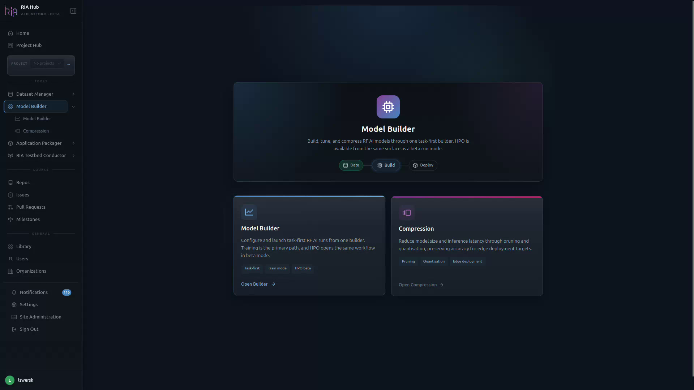

---

## Step 2 — Get oriented on the Model Trainer page

The Model Trainer page loads with a pipeline header at the top, configuration cards in the middle, and a live YAML preview on the right.

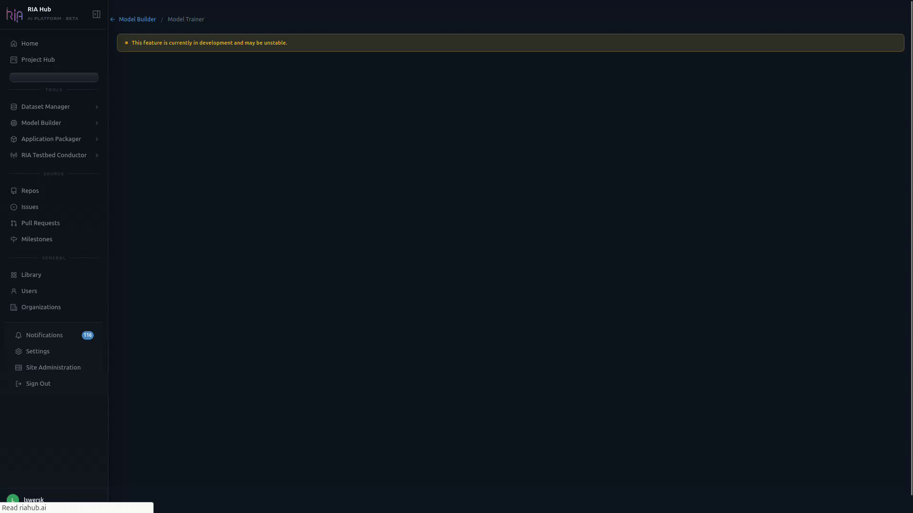

The page header is your control bar:

| Field | What it controls |
|---|---|
| **Progress** | Configuration completeness (e.g. `8 / 9` sections done). |
| **Active** | Number of currently running jobs. |
| **Runner** | The Actions runner that will execute the training (e.g. `dawson-gpu`). |
| **Mode** | `Train` (default) or `Hyperparameter Optimization` (beta). |
| **Repo** | Target repository where the workflow YAML is committed. |
| **Hide YAML / Submit Run** | Toggles the live YAML preview and submits the configured run. |

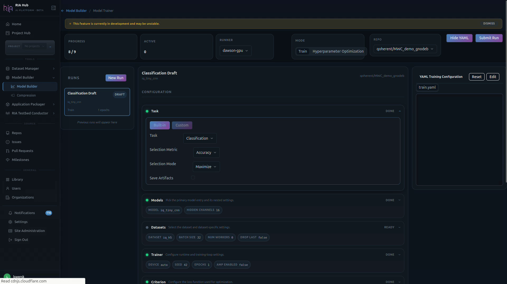

Each configuration card shows a status pill on the right (`DONE`, `READY`, `ACTIVE`) so you always know which parts of the run are configured.

---

## Step 3 — Pick a target repository

Click the **Repo** dropdown in the header and choose the repo that owns this training job. Only repositories you can push to are listed.

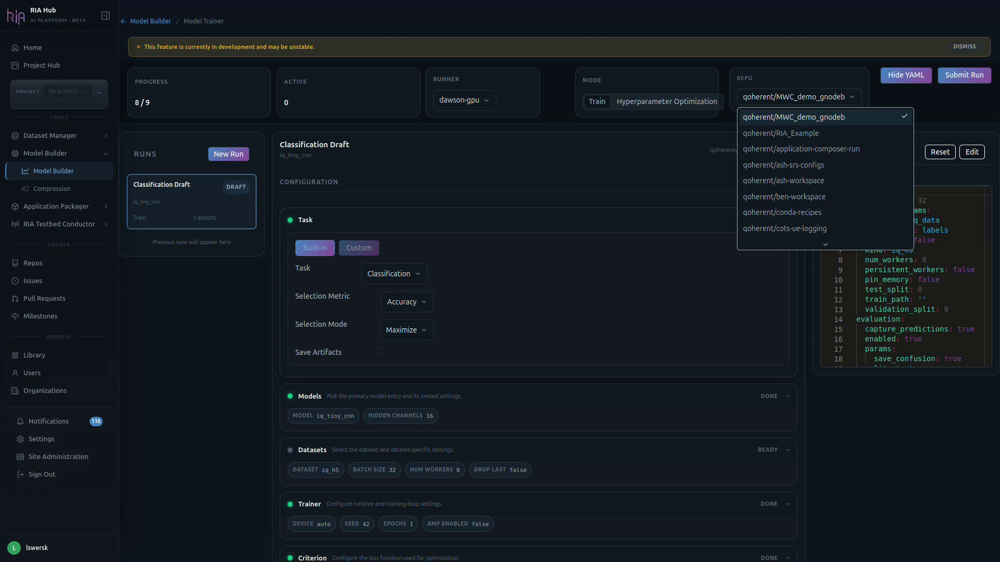

The selected repo determines:

- Where the `.riahub/workflows/train.yaml` file will be committed.
- Which runners are available in the **Runner** dropdown.

---

## Step 4 — Configure the Task

The **Task** section is the first card under **CONFIGURATION**. It controls *what* you are training a model to do.

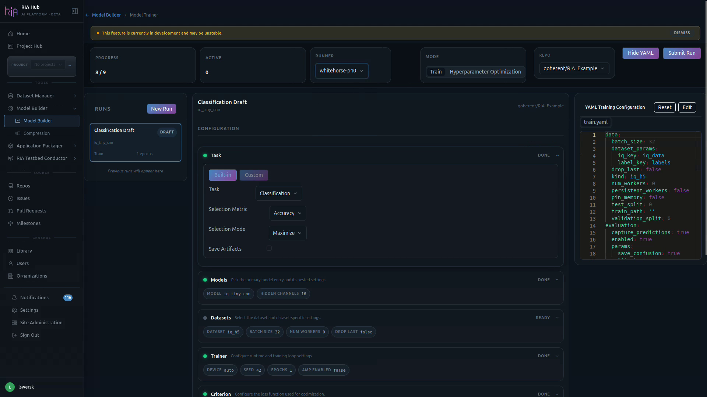

1. Toggle between **Built-in** and **Custom** tasks. Built-in covers common RF tasks (classification, detection, etc.); Custom lets you point at a `task.yaml` manifest in a connected repo.
2. **Task** — pick the task type, e.g. `Classification`.
3. **Selection Metric** — the metric used to choose the best checkpoint (e.g. `Accuracy`).
4. **Selection Mode** — `Maximize` or `Minimize` the selection metric.
5. **Save Artifacts** — turn on to keep model checkpoints from the run.

---

## Step 5 — Choose a model template

Expand the **Models** card and pick a template from the model picker. The right choice depends on your hardware and the complexity of the problem:

| Template | Typical use |
|----------|------------|
| **MobileNetV3** | Good starting point — runs on a `cpu` runner, trains in 10–30 minutes on a small dataset |
| **ResNet18** | Slightly higher capacity than MobileNetV3; use when accuracy matters more than speed |
| **WavesFM Linear Probe** | Fast WavesFM adaptation — train only the classification head; GPU runner recommended |
| **WavesFM LoRA** | Deeper WavesFM fine-tuning with low-rank weight matrices; GPU runner required |

For the modulation recognition tutorial, **MobileNetV3** on a `cpu` runner is the right choice.

For each model you can override per-model hyperparameters surfaced by the manifest:

- **MODEL** — the model entry file (e.g. `iq_tiny_cnn`).
- **HIDDEN CHANNELS** — and any other model-specific knobs (e.g. `16`).

### WavesFM-specific parameters

When a WavesFM template is selected, two additional fields appear:

| Parameter | Default | Notes |
|-----------|---------|-------|
| **Task** | `rml` | Must match a WavesFM-supported task name |
| **LoRA rank** | 32 | Lower values train faster; higher values adapt more |
| **LoRA alpha** | 64 | Scaling factor (`alpha / sqrt(rank)`); leave at `2 × rank` |

---

## Step 6 — Select your dataset

Expand the **Datasets** card. This is where you wire the model to the data on disk.

You have two ways to attach a dataset:

- **Browse Library** — click and select a curated `radio_dataset` from your repository Library. The builder reads the HDF5 attributes to detect the number of classes and the input shape. The OID (object identifier) of the selected dataset is written into the generated workflow's download step so the runner can fetch it from MinIO.
- **Per-path file pickers** — for **Train Path**, **Validation Path**, and **Test Path**, click the dropdown to browse `.h5` dataset files in your repos (the path format is `Datasets/<file>.h5 (owner/repo@branch)`).

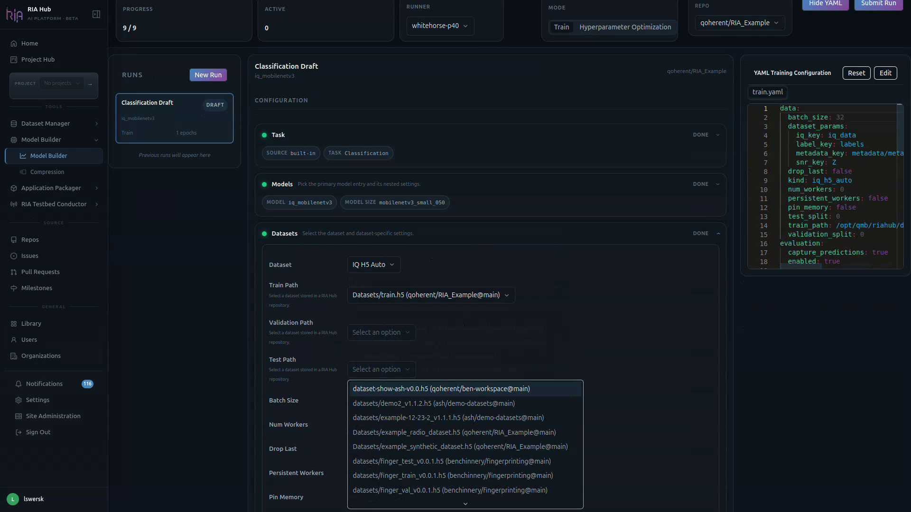

Below the paths are the loader-level controls:

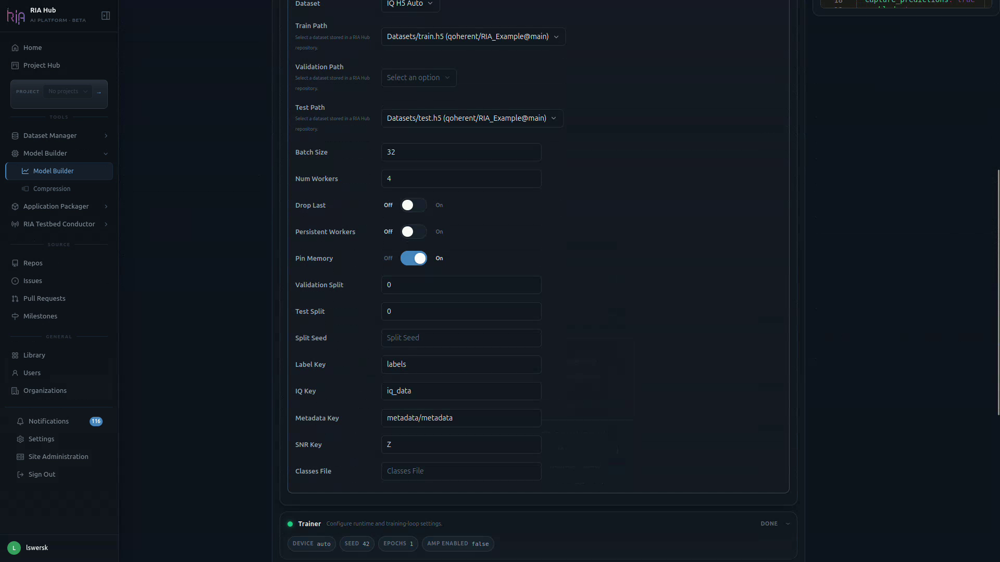

| Field | Purpose |
|---|---|
| **Batch Size** | Samples per training step (default `32` in the UI; `256` for the modulation recognition tutorial defaults). |
| **Num Workers** | Parallel data-loader workers. |
| **Drop Last / Persistent Workers / Pin Memory** | Standard PyTorch DataLoader switches. |
| **Validation Split / Test Split / Split Seed** | Use these if you want the loader to create the splits instead of supplying separate files (defaults to 80 / 20 train / val). |
| **Label Key / IQ Key / Metadata Key / SNR Key** | Keys inside the `.h5` file to read for labels, IQ samples, metadata and SNR. |
| **Classes File** | Optional file mapping class indices to names. |

---

## Step 7 — Configure training parameters

Sensible defaults are pre-filled across the remaining cards. Adjust only what you need.

### High-level defaults

| Parameter | Default | Notes |
|-----------|---------|-------|
| **Epochs** | 20 | Increase to 30–50 for small datasets |
| **Batch size** | 256 | Reduce if the runner runs out of memory |
| **Learning rate** | `0.001` | Adam/AdamW default |
| **Optimiser** | AdamW | SGD, Adam, AdamW, RMSprop available |
| **LR scheduler** | CosineAnnealingLR | Smooth decay; suits short runs |
| **Train / val split** | 80 / 20 | |
| **Evaluation metrics** | `accuracy`, `f1` | Add `precision`, `recall`, `auroc` as needed |
| **Export ONNX** | On | Recommended — required for edge deployment |
| **Upload confusion matrix** | Off | Enable to get a confusion matrix PNG in the artifacts |

### Trainer card

The **Trainer** card sets runtime and training-loop behaviour.

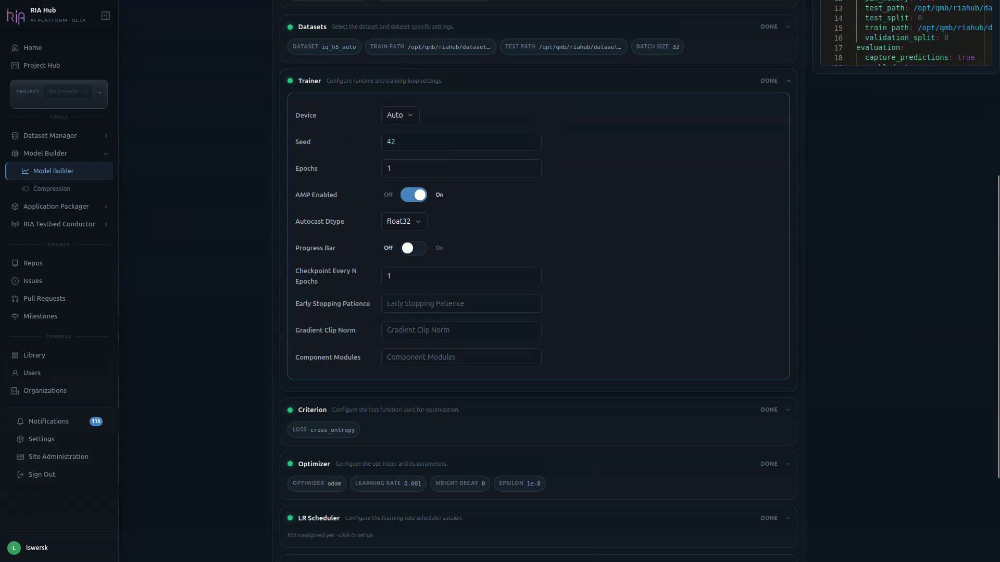

- **Device** — `Auto`, CPU, or a specific GPU.
- **Seed** — random seed for reproducibility (e.g. `42`).
- **Epochs** — number of training epochs.
- **AMP Enabled** — automatic mixed precision (on by default for GPU runs).
- **Autocast Dtype** — `float32`, `float16`, or `bfloat16`.
- **Progress Bar**, **Checkpoint Every N Epochs**, **Early Stopping Patience**, **Gradient Clip Norm**, **Component Modules** — optional fine-tuning controls.

### Criterion, Optimizer, LR Scheduler, Evaluation, Export

Each of the remaining cards controls one piece of the training recipe:

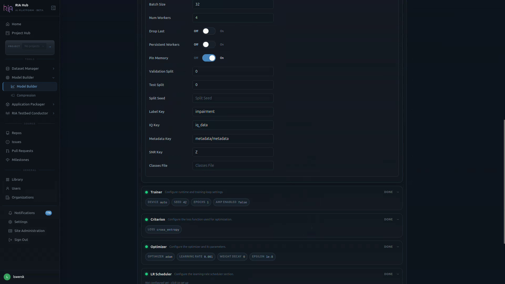

| Card | What to set |
|---|---|
| **Criterion** | Loss function, e.g. `cross_entropy`. |
| **Optimizer** | Optimizer name (e.g. `adam`), `learning_rate`, `weight_decay`, `epsilon`. |
| **LR Scheduler** | Optional — click the card to configure a schedule (warmup, cosine, etc.). |
| **Evaluation** | Metrics captured at evaluation time (e.g. `capture_predictions`, `save_confusion`). |
| **Export** | Output format(s) — typically ONNX export with a chosen opset and dynamic-batch flag. |

---

## Step 8 — Verify the live YAML

On the right side of the page, the **YAML Training Configuration** panel renders the `train.yaml` that will be submitted. As you change fields on the left, this updates in real time.

Use **Edit** to hand-tweak any value the UI does not expose, or **Reset** to go back to the canonical UI-generated config.

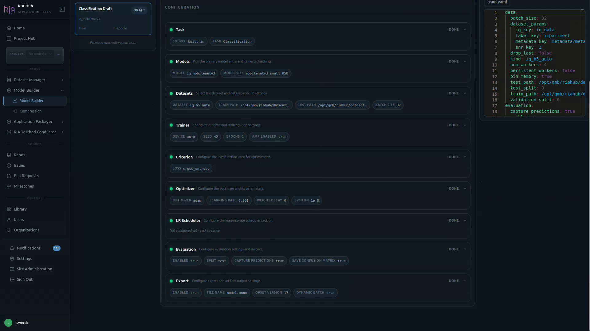

When every card shows `DONE` (or `READY`), the **Progress** counter in the header reaches `9 / 9` and the run is ready to submit.

---

## Step 9 — Select a runner

Click the **Runner** dropdown in the header (or **View Available Runners**) to see registered runners. Select a runner whose label matches the compute you need.

| Runner label | Hardware | Appropriate for |
|-------------|----------|----------------|
| `cpu` | CPU-only | Tutorial runs, small datasets (< 100 k slices) |
| `gpu-t4` | NVIDIA T4 | Medium datasets, WavesFM LP |
| `gpu-a100` | NVIDIA A100 | Large datasets, WavesFM LoRA, HPO sweeps |

If no runner is online, the workflow will queue and wait. Check runner status at **Workflows → Management → Runners**.

---

## Step 10 — Submit

Click **Submit Run** (also labelled **Train**) in the top-right of the header. The Model Builder:

1. Posts to the backend to render the workflow and training config YAML
2. Commits `.riahub/workflows/train.yaml` and `.riahub/train_configs/train.yaml` to your repository
3. Redirects you to the repository's **Actions** tab

A **Submit Model Trainer** dialog appears first:

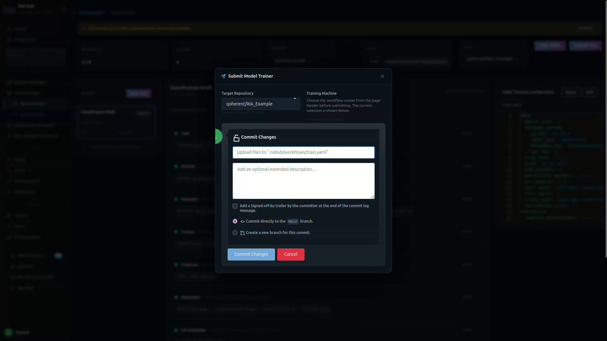

1. Confirm the **Target Repository** and the **Training Machine** (runner).
2. The dialog shows the upload path — `.riahub/workflows/train.yaml`.
3. Optionally add an extended commit description.
4. Choose **Commit directly to `main`** or **Create a new branch for this commit**.
5. Click **Commit Changes**.

The workflow triggers automatically on the branch push.

---

## Step 11 — Monitor the run

You are redirected to the **Workflows** tab of your repo and the new **Training run** appears at the top. The right pane shows the live job steps:

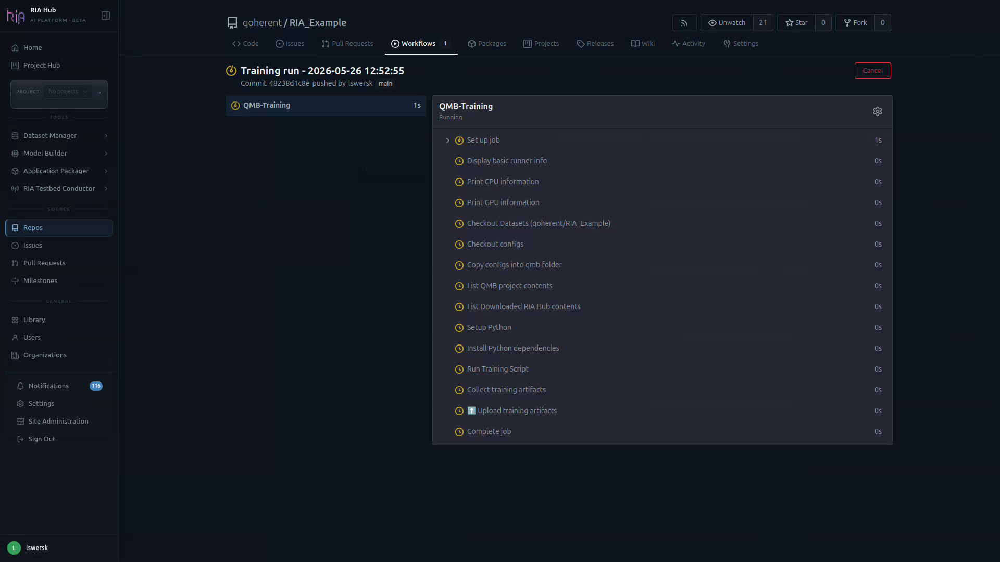

The Actions run shows one job with these steps:

| Step | What it does |
|------|-------------|
| Runner info | Prints OS, CPU, and GPU info |
| Download dataset | Fetches the HDF5 file from MinIO using the dataset OID |
| Checkout configs | Sparse-checks out `.riahub/train_configs/` |
| QMB Training | Runs `qmb train --config-path .riahub/train_configs/train.yaml` |
| Collect training artifacts | Gathers `best.pt`, `*.onnx`, and optional PNG outputs |
| Upload training artifacts | Uploads a `training-artifacts` zip to Actions artifact storage |

Click any step to expand its live log.

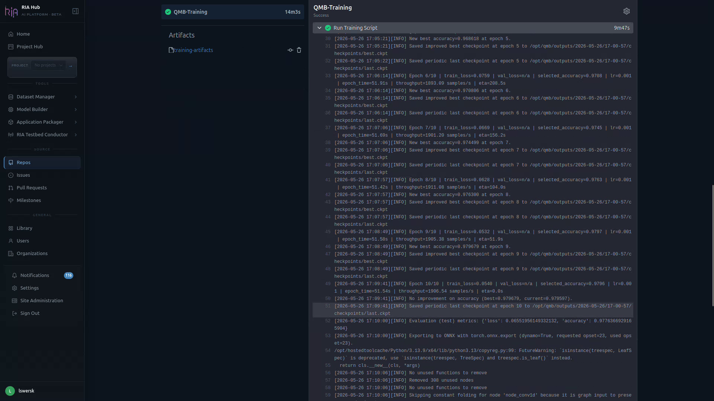

Training logs appear in the **QMB Training** step in real time. Expect output like:

```
Epoch  1/20 — train_loss: 0.9842  val_loss: 0.9511  val_accuracy: 0.6421
Epoch  2/20 — train_loss: 0.7213  val_loss: 0.6901  val_accuracy: 0.7834
…
Epoch 20/20 — train_loss: 0.1021  val_loss: 0.0988  val_accuracy: 0.9876
Best val accuracy: 0.9901  (epoch 19)
```

When the workflow finishes, the header turns green and the **Artifacts** panel lists the produced bundle (e.g. `training-artifacts`).

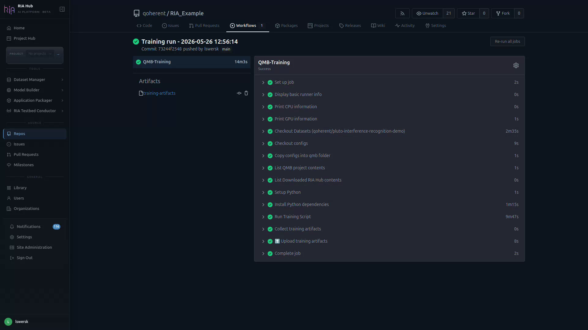

From here you can also **Re-run all jobs** — useful for re-running on a different runner without changing config.

---

## Step 12 — Download and publish artifacts

Training artifacts are stored in **Gitea Actions artifact storage**, not pushed back to the Library automatically.

When the run finishes:

1. On the Actions run page, click **training-artifacts** under Artifacts.
2. Extract the zip — you will find `best.pt`, `best.onnx`, and optionally `confusion_matrix.png`.

To register the model in your repository's Library, you can use either the **Git LFS CLI** or the **RIA Hub web UI**.

### Option A — Git LFS from the terminal

```bash
git lfs track "*.pt" "*.onnx"
git add .gitattributes

mkdir -p models/
cp /path/to/best.onnx models/modrec-tutorial-v1.onnx
cp /path/to/best.pt   models/modrec-tutorial-v1.pt

git add models/
git commit -m "add trained modrec model v1"
git push
```

### Option B — Upload via the web UI

1. In your repository, click **Add a file → Upload file**.
2. Drop the artifacts produced by the run (`confusion_matrix.png`, `model.onnx`, `model.ckpt`).
3. RIA Hub recognises large binary types and offers **Track with Git LFS** for `.png`, `.onnx`, and `.ckpt`. Tick each box.

   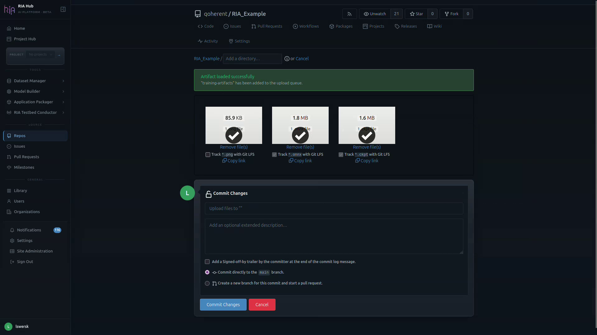

4. A fourth tile, `.gitattributes`, is added automatically to record the LFS patterns.

   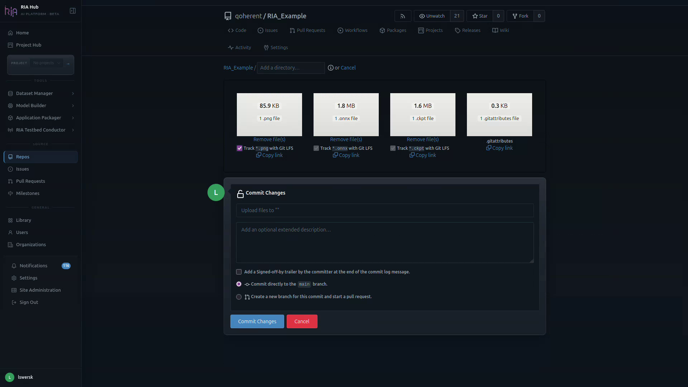

5. Commit the changes — directly to `main` or via a pull request.

The files now show up in the repo file listing alongside your code and dataset:

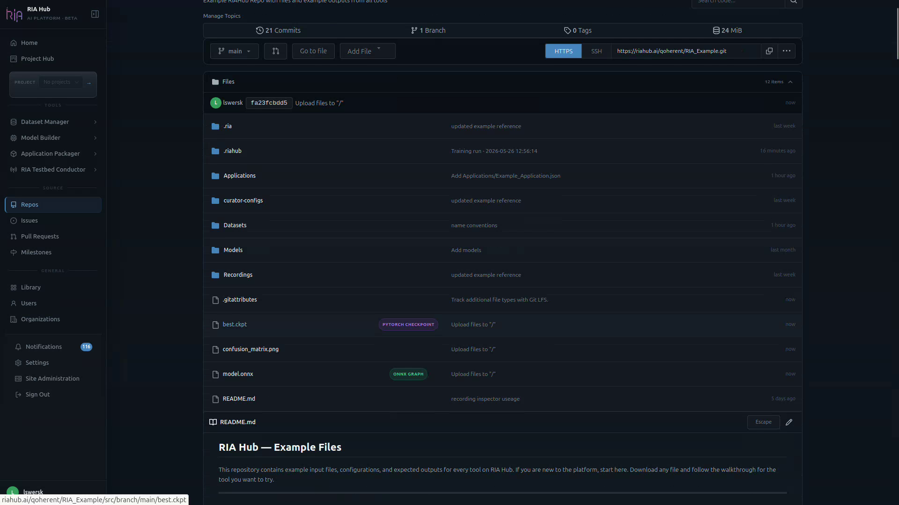

RIA Hub picks up the new files on push and registers them in the Library:

- `modrec-tutorial-v1.pt` → `pytorch_checkpoint` asset
- `modrec-tutorial-v1.onnx` → `onnx_graph` asset

---

## Step 13 — Inspect the evaluation output

Open `confusion_matrix.png` in the repo to confirm the model trained successfully:

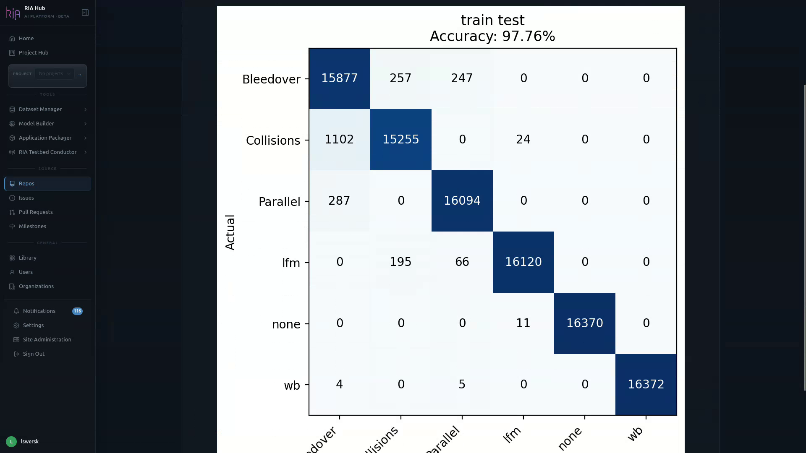

If accuracy looks good, the `.onnx` artifact is ready to flow into:

- **Model Builder → Compression** to prune/quantise for edge deployment.
- **Application Packager** to bundle into a deployable application.
- **RIA Testbed Conductor** to run on real radio hardware.

---

## Troubleshooting

### The workflow does not trigger after submit

The workflow file has an `on.push.branches` trigger for the branch the Model Builder targeted. If you push to a different branch, the workflow will not fire. Check that the branch name in `.riahub/workflows/train.yaml` matches the branch you are on.

### Dataset not found (download step fails)

The `RIAHUB_BASE_URL` variable must be set so the runner can build the MinIO download URL. Set it under **Settings → Variables → Actions** in your repository, value `https://riahub.ai` (or your instance URL).

### Out of memory

Reduce batch size in the Model Builder form and re-submit, or switch to a larger runner.

### Model accuracy is poor (< 60 % on modulation recognition)

Check these in order:

1. **Class balance** — use the [Inspector](/guides/dataset-manager/inspector/) Balance view; unequal class counts hurt accuracy
2. **Label consistency** — use the Sample view to confirm slices visually match their labels
3. **Epochs** — try 30–50 epochs; 20 may not converge on small datasets
4. **SNR** — if synthetic recordings use very high noise power, signals become indistinguishable; re-generate with lower `--noise-power`

### A section stays `ACTIVE` instead of `DONE`

Open the card; one required field is empty or invalid. The YAML panel on the right also highlights the missing key.

### The Repo dropdown is empty

You do not have push access to any repos under the current project. Switch projects or request access.

### The Runner dropdown is empty

No runner is registered for the selected repo. Register one via `Settings → Actions → Runners` on the repo or organisation.

### Switching to HPO mode

Change **Mode** in the header to `Hyperparameter Optimization`. Extra columns (sweep ranges, search space) appear on each relevant section. HPO is currently in beta.

### Editing YAML directly

Use the **Edit** button on the YAML panel for anything not exposed in the UI. The UI will not overwrite custom keys it does not recognise.

---

## Next steps

- **Hyperparameter optimisation** — open **Model Builder → HPO** to run an Optuna sweep across learning rate, batch size, and architecture variants
- **Edge deployment** — take the `best.onnx` to the **Application Packager** to build a Holoscan inference application and deploy it to a registered Screens agent
- **Example files** — The [RIA_Example repository](https://riahub.ai/qoherent/RIA_Example) includes a pre-curated `Datasets/example_radio_dataset.h5` and example `.ckpt`/`.onnx` model files, and a ready-to-adapt `train.yaml` workflow.

---

## For developers — where things live in the codebase

| Concern | Path |
|---|---|
| Backend modules (Python controller) | [ria-hub/controller/app/modules/model_builder/](ria-hub/controller/app/modules/model_builder/) |
| Web routes (Go) | [ria-hub/routers/web/modelbuilder/](ria-hub/routers/web/modelbuilder/) |
| HTML templates | [ria-hub/templates/modelbuilder/](ria-hub/templates/modelbuilder/) |
| JS components | [ria-hub/web_src/js/components/model-builder/](ria-hub/web_src/js/components/model-builder/) |
| JS features (page entry points) | [ria-hub/web_src/js/features/model-builder/](ria-hub/web_src/js/features/model-builder/) |
| Backend tests | [ria-hub/controller/tests/modules/model_builder/](ria-hub/controller/tests/modules/model_builder/) |
